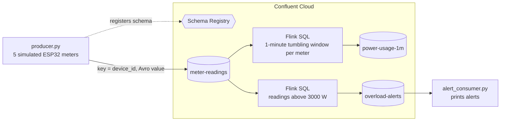
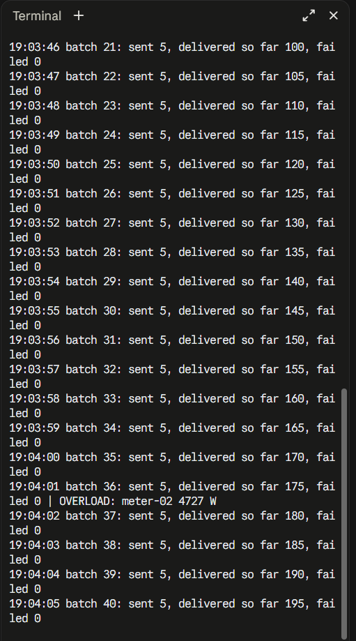
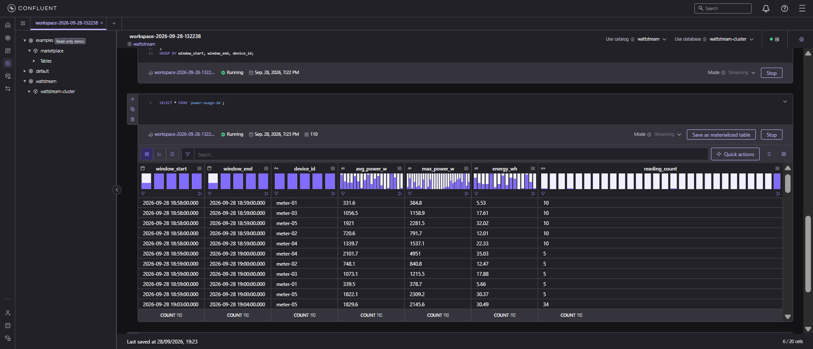
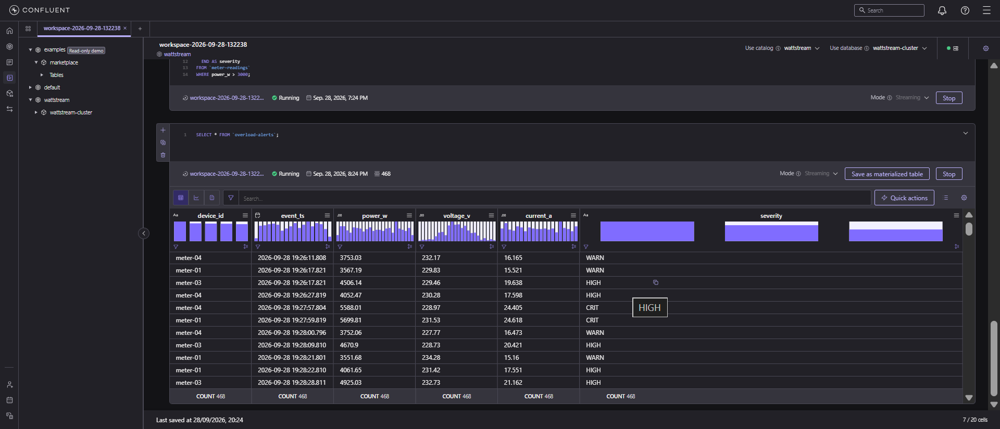
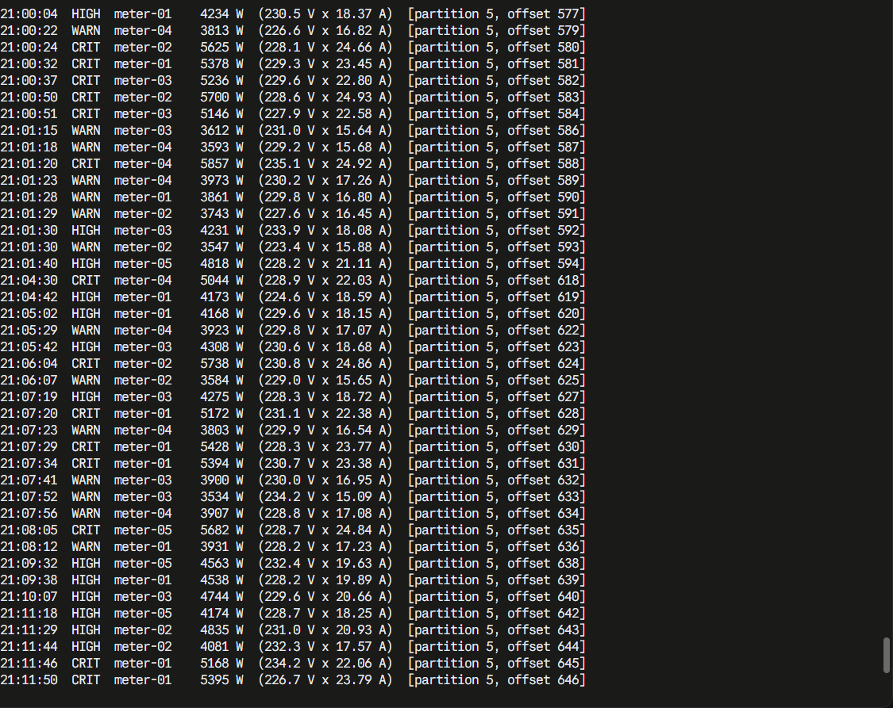
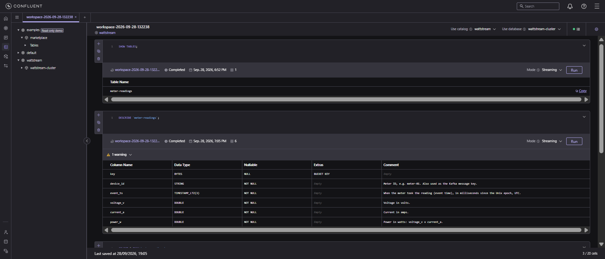
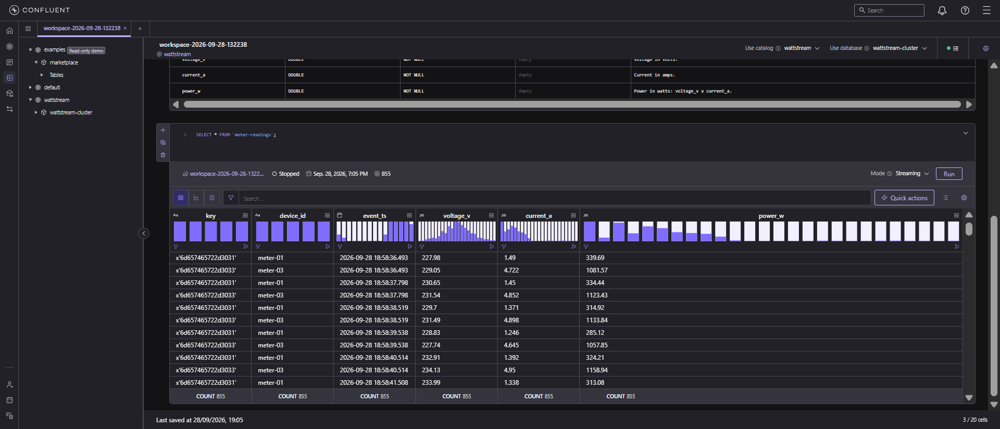

# WattStream

**Real-time energy telemetry pipeline with Apache Kafka, Schema Registry and Flink SQL.**

WattStream streams smart-meter readings through Apache Kafka and analyzes them as they arrive. A Python producer publishes ESP32-style meter readings to Apache Kafka, with message schemas managed in Schema Registry. Flink SQL jobs compute per-device windowed power usage and route overload alerts to an alerts topic, where a Python consumer prints them. It all runs on Confluent Cloud (managed Kafka, Schema Registry and Flink), so there are no servers to operate.

WattStream extends my IoT project [Smart Watt](https://github.com/SHYanwad-Div/SmartWatt), where an ESP32 with voltage and current sensors streams readings to a live dashboard. Smart Watt covers a single device; WattStream is the streaming backend a whole fleet of meters could feed, processing readings in real time and flagging overloads.

## Architecture



| Part | What it does |
|---|---|
| [`producer.py`](producer.py) | Simulates 5 meters sending 1 reading per second each: voltage around 230 V, current per device profile, `power_w = voltage × current`. About 2% of readings are overload spikes. |
| [`schemas/meter_reading.avsc`](schemas/meter_reading.avsc) | Avro schema for a reading, registered in Schema Registry on the first send. |
| [`flink/01_power_usage_1m.sql`](flink/01_power_usage_1m.sql) | 1-minute tumbling window per meter: average and max power, energy (Wh) and reading count, written to `power-usage-1m`. |
| [`flink/02_overload_alerts.sql`](flink/02_overload_alerts.sql) | Every reading above 3000 W, with a severity (WARN / HIGH / CRIT), written to `overload-alerts`. |
| [`alert_consumer.py`](alert_consumer.py) | Consumer group that reads `overload-alerts` and prints readable alert lines. |

## Design decisions

- **Message key = `device_id`.** Kafka hashes the key to pick a partition, so every reading from one meter lands on the same partition and stays in order.
- **Avro with Schema Registry.** The schema is registered once, under the subject `meter-readings-value`. Each message carries only a 5-byte header with the schema ID, so a reading is about 44 bytes, and Confluent Cloud Flink sees the topic as a typed table automatically.
- **Event time, not processing time.** The producer sets each record's Kafka timestamp to the reading's `event_ts`. Flink exposes it as `$rowtime`, so windows follow when readings were taken, not when they were processed. The default watermark is the newest `$rowtime` per partition minus 180 ms.
- **Safe writes.** `acks=all` plus idempotence: a write only counts once all in-sync replicas have it, and retries can't create duplicates.
- **Continuous Flink jobs.** `CREATE TABLE ... AS SELECT` creates each output topic and its schema from the query, then keeps the job running.
- **Consumer groups and offsets.** The alert consumer commits its offsets, so a restart resumes where it stopped, and extra consumers in the same group share the partitions.
- **No secrets in git.** API keys live in a git-ignored `.env`; the repo ships [`.env.example`](.env.example) with empty values.

## Screenshots

**Producer:** one batch per second from 5 meters, with overload spikes flagged.



**Flink: power usage per meter per minute** (`power-usage-1m`)



**Flink: overload alerts with severity** (`overload-alerts`)



**Alert consumer:** each alert with the partition and offset it was read from.



<details>
<summary>More screenshots: the Avro schema as a Flink table</summary>

The schema's types become typed columns, and its field docs become column comments.





</details>

## Tech stack

- **Apache Kafka:** Confluent Cloud, Basic cluster
- **Schema Registry + Avro:** Confluent Stream Governance (Essentials)
- **Apache Flink SQL:** Confluent Cloud compute pool
- **Python 3.13:** confluent-kafka (librdkafka), fastavro, python-dotenv, pytest

## Run it yourself

### 1. Confluent Cloud

Create these in one cloud region:

1. An environment with the Stream Governance **Essentials** package. Schema Registry is enabled with the first cluster.
2. A **Basic** Kafka cluster.
3. A topic named `meter-readings` (default settings).
4. Two API keys: one scoped to the Kafka cluster, one scoped to Schema Registry.
5. A Flink compute pool (the environment may already have a default one).

### 2. Local setup (Windows PowerShell)

```powershell
git clone https://github.com/SHYanwad-Div/wattstream.git
cd wattstream
python -m venv .venv
.\.venv\Scripts\Activate.ps1
pip install -r requirements.txt
Copy-Item .env.example .env   # then fill in the endpoints and API keys
python config.py              # checks the Kafka and Schema Registry connections
```

### 3. Run the pipeline

1. Start the producer: `python producer.py` (options: `--devices`, `--rate`, `--duration`).
2. In the Confluent Cloud SQL workspace, run the `CREATE TABLE ... AS SELECT` statement from each file in [`flink/`](flink).
3. Start the alert consumer: `python alert_consumer.py`.

### Tests

```powershell
pytest
```

Unit tests for the reading generator: value ranges, the power formula, and the roughly 2% spike rate. No Kafka or credentials needed.

## Project structure

```
wattstream/
├── producer.py              # simulated meters -> Kafka (Avro)
├── alert_consumer.py        # prints overload alerts
├── config.py                # loads settings from .env; `python config.py` tests the connections
├── schemas/
│   └── meter_reading.avsc   # Avro schema for a reading
├── flink/
│   ├── 01_power_usage_1m.sql
│   └── 02_overload_alerts.sql
├── tests/
│   └── test_producer.py
├── docs/images/             # screenshots
├── requirements.txt
├── pytest.ini
└── .env.example
```

## What I learned

<!--
Write this part in your own words. Prompts:
- Key -> partition: what did you see when meter-01 and meter-03 both landed on partition 0?
- Event time vs processing time: why do the windows use $rowtime, and what does a watermark do?
- Partitions and parallelism: why did the second consumer in the same group sit idle?
- Schema Registry: what would happen if you changed the schema, and why is Avro smaller than JSON?
- Production: what would you change (service accounts, ACLs, monitoring, keyed output topics)?
- A problem you hit and how you solved it.
-->

_Coming soon._

## Stretch goals

- [ ] Streamlit dashboard reading `power-usage-1m`
- [ ] Kafka Connect sink to a database
- [ ] Real ESP32 (Smart Watt hardware) publishing readings instead of the simulator
- [ ] Key the Flink output topics by `device_id`, so alerts spread across partitions and consumers share the load
- [ ] Service accounts with least-privilege ACLs instead of personal API keys
- [ ] Integration tests against a local Kafka with Testcontainers

## Cost and cleanup

Flink statements are billed per CFU-minute while they run (at least 1 CFU each). Stop them from the Flink **Statements** tab when you're done, and delete the Confluent Cloud environment to remove everything.
